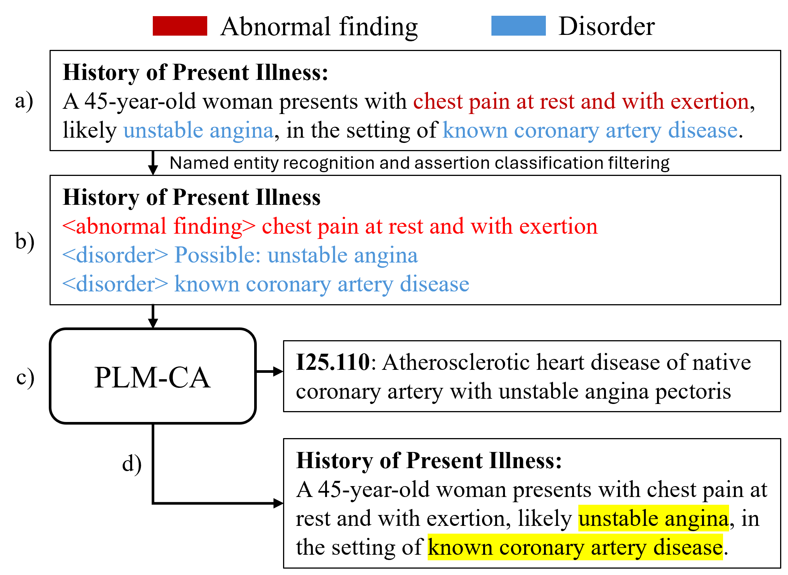
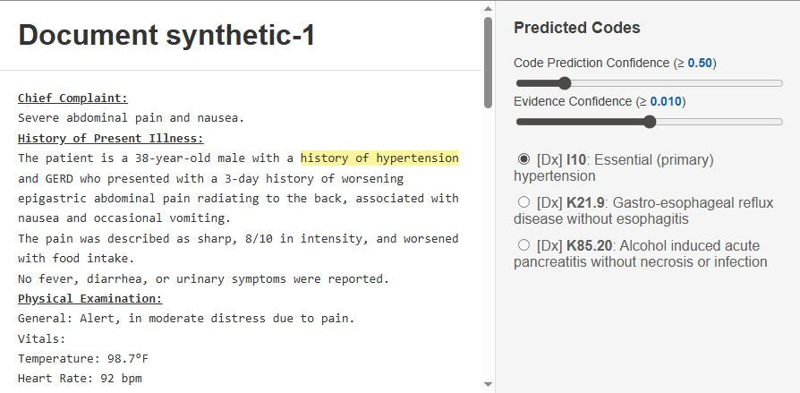

# Less is More: Explainable and Efficient ICD Code Prediction with Clinical Entities

[](https://aclanthology.org/2025.acl-long.1489/)
[](https://doi.org/10.18653/v1/2025.acl-long.1489)
[](https://github.com/jd4501/entity-coding/releases)
[](LICENSE)
[](https://www.python.org/downloads/release/python-3115/)
[](https://pytorch.org/)
[](data/README.md)

Paper: <https://aclanthology.org/2025.acl-long.1489/>



_Pipeline schematic (Figure 1 of the manuscript): NER and assertion classification distil a discharge summary into an entity-only document; PLM-CA predicts ICD-10 codes; AttInGrad surfaces in-text evidence. The example shown is synthetic._

This repository accompanies the ACL 2025 paper of the same name. The pipeline takes raw clinical notes through Named Entity Recognition (NER) and Assertion Classification (AC), consolidates the surviving entities into a short "entity-only" document, and runs PLM-CA for ICD-10-CM/PCS code prediction with attribution-based evidence.

On MIMIC-IV this compresses discharge summaries to roughly 22% of the full-text length while staying within about one F1 point of the full-text baseline's coding performance. Additionally, the surviving entity spans serve as natural, clinically coherent code evidence.

> **What you can do with this repo**
>
> - Run research inference for discharge-style clinical notes you are permitted to process, producing ICD-10-CM/PCS code predictions with in-text evidence.
> - Recompute selected manuscript artefacts from shipped outputs, with remaining analyses requiring credentialed data, retraining, or manual review as documented in `docs/`.
> - Rebuild the entity-only ICD training inputs and AC training corpus from their gated source datasets.

> **Intended use.** This is a research artefact accompanying an ACL 2025 paper. The trained models inherit non-commercial terms from MIMIC and i2b2/n2c2 sources and are not cleared for clinical decision support, billing automation, or commercial deployment. See [docs/licenses.md](docs/licenses.md) for the per-source restrictions.

> **Reproduction snapshot.** For paper-equivalent results, check out the [`v1.0.0` release](https://github.com/jd4501/entity-coding/releases/tag/v1.0.0). The `main` branch will continue to receive fixes and improvements after this release, and some future changes may shift observable outputs relative to the manuscript.

The ICD coding model and evidence-extraction code under [`external/plm_ca/`](external/plm_ca/) are a vendored copy of [JoakimEdin/explainable-medical-coding](https://github.com/JoakimEdin/explainable-medical-coding) (commit [`8269cc7`](https://github.com/JoakimEdin/explainable-medical-coding/commit/8269cc7246b88fa5dd299191713ed7475b908537)) with additions for entity-aware training inputs and per-line attribution aggregation. Any work reusing that subdirectory must cite Edin et al. (2024); see [docs/licenses.md#citations](docs/licenses.md#citations).

---

## Quick start

Four commands take a fresh clone to rendered ICD predictions on three synthetic discharge summaries.

```bash
# 1. Create and activate the conda environment.
mamba env create -f environment.yml && conda activate entitycoding

# 2. Download the NER, AC, entity-only ICD, and tokenizer checkpoints.
python data_download.py --models ner,ac,entity-only --cleanup

# 3. Fetch the base RoBERTa-PM that the entity-only ICD model loads on top of.
( cd external/plm_ca && make download_roberta )

# 4. Run the full pipeline on the bundled synthetic notes.
python run_pipeline.py data/sample_data/sample_notes.csv \
    --visualize-entities --visualize-evidence
```

Open `results/visualised_notes/synthetic-1.html` to see ICD codes with their entity evidence highlighted:



_Sample render of `results/visualised_notes/synthetic-1.html`. The right panel lists predicted ICD codes; selecting one highlights the supporting entity evidence in the note body. The note shown is one of the bundled GPT-4o synthetic discharge summaries, so no real patient data appears._

---

## At a glance

The pipeline distils a raw discharge summary into a short entity-only document, then runs PLM-CA on that consolidated input. On MIMIC-IV the consolidation cuts both the input length the coding model sees and the time required to train it:

| Metric                         | Full-text | Entity-only |
| ------------------------------ | --------- | ----------- |
| Median document length (words) | 1,627     | 353         |
| Training time (single L4 GPU)  | 28.8 h    | 10.9 h      |

ICD coding F1, MAP, and the full Table 7 metric suite are in the [paper](https://aclanthology.org/2025.acl-long.1489/); see [docs/reproduce.md](docs/reproduce.md) for the recompute commands.

---

## Repository tour

| Path                                                                 | What's there                                                                                                                                                | See                                                                                    |
| -------------------------------------------------------------------- | ----------------------------------------------------------------------------------------------------------------------------------------------------------- | -------------------------------------------------------------------------------------- |
| [`run_pipeline.py`](run_pipeline.py)                                 | Top-level orchestrator: NER + AC, then ICD coding, with optional HTML visualisations.                                                                       | [docs/inference.md](docs/inference.md)                                                 |
| [`data_download.py`](data_download.py)                               | Fetches all model checkpoints listed in [`config/download_config.yaml`](config/download_config.yaml).                                                       | [docs/inference.md#models](docs/inference.md#models)                                   |
| [`ner/`](ner/)                                                       | Entity extraction, assertion filtering, NER training, and dataset-prep helpers.                                                                             | [`ner/README.md`](ner/README.md)                                                       |
| [`ac/`](ac/)                                                         | Assertion-classification training pipeline (i2b2 2010/2012, MIMIC-III bvanaken, MIMIC-IV-Ext-EntityCoding).                                                 | [`ac/README.md`](ac/README.md)                                                         |
| [`code_evidence/`](code_evidence/)                                   | MDACE evidence evaluation notebook plus per-note HTML visualiser.                                                                                           | [docs/evidence.md](docs/evidence.md)                                                   |
| [`external/plm_ca/`](external/plm_ca/)                               | Vendored PLM-CA fork: ICD coding training, inference, and AttInGrad-based attributions.                                                                     | [`external/plm_ca/README.md`](external/plm_ca/README.md)                               |
| [`data/`](data/)                                                     | Default-deny staging area for clinical data plus committed sample notes and ICD code descriptions.                                                          | [`data/README.md`](data/README.md)                                                     |
| [`data/sample_data/`](data/sample_data/)                             | Three GPT-4o synthetic discharge summaries used by the pipeline test above.                                                                                 | [`data/sample_data/README.md`](data/sample_data/README.md)                             |
| [`data/mimic-iv-ext-entitycoding/`](data/mimic-iv-ext-entitycoding/) | Local landing directory for the 400-note PhysioNet annotation release once published and credentialed.                                                      | [`data/mimic-iv-ext-entitycoding/NOTE.md`](data/mimic-iv-ext-entitycoding/NOTE.md)     |
| [`results/sample_results/`](results/sample_results/)                 | Committed reference outputs of the sample pipeline run.                                                                                                     | [docs/inference.md#reference-run](docs/inference.md#reference-run)                     |
| `results/*.csv` and `results/*.txt`                                  | Tracked supplementary artefacts referenced by the manuscript (per-code metrics for code-level inspection, paper permutation results, NER-set service distribution). MDACE evidence-comparison CSVs are not shipped (they contain text derived from gated MIMIC notes); the notebook regenerates them locally. | [docs/reproduce.md](docs/reproduce.md)                                                 |
| [`config/download_config.yaml`](config/download_config.yaml)         | Model URLs, sizes, and target paths for `data_download.py`.                                                                                                 | [docs/inference.md#models](docs/inference.md#models)                                   |

---

## Install

A single conda environment, `entitycoding`, covers every script in the repo (top-level helpers, `ner/`, `ac/`, `code_evidence/`, and the vendored `external/plm_ca/`). Conda's classic solver may fail on this environment; mamba or conda with libmamba is recommended.

```bash
# Recommended:
mamba env create -f environment.yml

# Or with conda + libmamba:
conda env create -f environment.yml --solver libmamba

conda activate entitycoding
```

Python 3.11.5, torch 2.1.1, transformers 4.38.1. For platform gotchas (Windows OpenMP, wandb prompts, the PLM-CA fork's Poetry path) see [docs/troubleshooting.md](docs/troubleshooting.md).

---

## Documentation

Deeper material lives under [`docs/`](docs/). If you just want to:

- **Reproduce a specific paper artefact** (table, figure, ablation): [docs/reproduce.md](docs/reproduce.md)
- **Run the pipeline on your own discharge notes**: [docs/inference.md](docs/inference.md)
- **Retrain the entity-only PLM-CA from MIMIC-IV inputs**: [docs/training.md](docs/training.md)
- **Reproduce MDACE evidence overlap** (Tables 8/12, Appendix B): [docs/evidence.md](docs/evidence.md)
- **Understand the per-source licence terms**: [docs/licenses.md](docs/licenses.md)
- **Hit a platform-specific snag**: [docs/troubleshooting.md](docs/troubleshooting.md)

### Per-area READMEs

- [`data/README.md`](data/README.md): staging-area map for clinical inputs and model downloads.
- [`ner/README.md`](ner/README.md): entity extraction and NER training internals.
- [`ac/README.md`](ac/README.md): assertion classification training pipeline.
- [`external/plm_ca/README.md`](external/plm_ca/README.md): vendored PLM-CA fork (upstream README + fork additions).

---

## Licenses

This repository assembles code, model weights, and references to gated clinical data; different parts carry different terms. The code is [MIT](LICENSE). The trained model weights inherit non-commercial restrictions from their MIMIC and i2b2/n2c2 training data. Source clinical data (MIMIC-III, MIMIC-IV, MIMIC-IV-Note, and the MIMIC-IV-Ext-EntityCoding release once published) requires PhysioNet credentialed access; i2b2/n2c2 requires DBMI registration; bvanaken assertion labels and MDACE annotations are public.

| Artefact class              | License / access                              | Where to look                                                                                                             |
| --------------------------- | --------------------------------------------- | ------------------------------------------------------------------------------------------------------------------------- |
| Repository code             | MIT                                           | [LICENSE](LICENSE)                                                                                                        |
| Trained model weights       | Non-commercial (inherited from training data) | [docs/licenses.md](docs/licenses.md#trained-model-weights-non-commercial-only)                                            |
| MIMIC-III / MIMIC-IV inputs | PhysioNet Credentialed Health Data License    | [docs/licenses.md](docs/licenses.md#source-clinical-data-physionet-credentialed-access), [data/README.md](data/README.md) |
| MDACE annotations           | CC BY 4.0 (note text still under PhysioNet)   | [docs/licenses.md](docs/licenses.md#mdace-annotations)                                                                    |

See [docs/licenses.md](docs/licenses.md) for the full per-source breakdown and the secondary citations that accompany the main paper.

---

## How to cite

If you use this code, the PhysioNet annotation dataset once published, or the distributed model weights, please cite:

```bibtex
@inproceedings{douglas-etal-2025-less,
    title = "Less is More: Explainable and Efficient {ICD} Code Prediction with Clinical Entities",
    author = "Douglas, James C.  and
      Gan, Yidong  and
      Hachey, Ben  and
      Kummerfeld, Jonathan K.",
    editor = "Che, Wanxiang  and
      Nabende, Joyce  and
      Shutova, Ekaterina  and
      Pilehvar, Mohammad Taher",
    booktitle = "Proceedings of the 63rd Annual Meeting of the Association for Computational Linguistics (Volume 1: Long Papers)",
    month = jul,
    year = "2025",
    address = "Vienna, Austria",
    publisher = "Association for Computational Linguistics",
    url = "https://aclanthology.org/2025.acl-long.1489/",
    doi = "10.18653/v1/2025.acl-long.1489",
    pages = "30835--30847",
    ISBN = "979-8-89176-251-0"
}
```

For the planned PhysioNet annotation release, the Edin et al. PLM-CA paper, the bvanaken assertion labels, the Lewis et al. RoBERTa-PM encoder, and the Cheng et al. MDACE annotations, see [docs/licenses.md#citations](docs/licenses.md#citations).

GitHub also exposes a "Cite this repository" button driven by [CITATION.cff](CITATION.cff).
