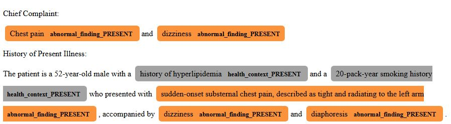

# Inference: running the pipeline on your own notes

What this page covers: how to point the entity-based ICD coding pipeline at discharge-style notes you are permitted to process (CSV, parquet, or a single string), what data the pipeline assumes is staged where, which model checkpoints feed which stage, and the hardware envelope it runs in. The end-to-end command in [Quick start](../README.md#quick-start) is the smallest entry point; this page is the full reference for non-demo research runs.

## Models

`python data_download.py --cleanup` fetches every artefact controlled by `config/download_config.yaml`. Pass `--models <selector,...>` to download a subset. The entity-only and fulltext PLM-CA bundles also include released-checkpoint prediction feathers, so their downloaded archives are larger than the bare checkpoint files.

| Selector      | Model                                                                 | Size    | Path                                                                             | Used by                                      |
| ------------- | --------------------------------------------------------------------- | ------- | -------------------------------------------------------------------------------- | -------------------------------------------- |
| `ner`         | RoBERTa-PM NER token classifier                                       | 433 MB  | `data/models/ner_model/`                                                         | `ner/extract_entities.py`                    |
| `ac`          | RoBERTa-PM assertion classifier                                       | 434 MB  | `data/models/ac_model/`                                                          | `ner/extract_entities.py`                    |
| `roberta`     | RoBERTa-base-PM-M3-Voc-distill-align-hf                               | ~470 MB | `data/models/RoBERTa-base-PM-M3-Voc-distill-align-hf/`                           | NER and AC retraining only                   |
| `entity-only` | Entity-only ICD-10 PLM-CA model + tokenizer (5 entity special tokens) | ~1.3 GB | `external/plm_ca/models/entityonly/`, `external/plm_ca/models/tokenizer_latest/` | `external/plm_ca/infer_with_explanations.py` |
| `fulltext`    | Full-text ICD-10 PLM-CA baseline                                      | ~1.3 GB | `external/plm_ca/models/fulltext/`                                               | full-text evidence flow                      |

**Note: two RoBERTa-PM variants.** The `roberta` selector above pulls the _distill-align_ variant used as initialisation for NER and AC fine-tuning. PLM-CA training and inference use the _base_ RoBERTa-PM variant, which lives at `external/plm_ca/models/roberta-base-pm-m3-voc-hf/` and is fetched separately by `( cd external/plm_ca && make download_roberta )`. `data_download.py --models roberta` does not satisfy that PLM-CA dependency. Do not point one path at the other.

## What data do I need?

Start with the smallest dataset that matches what you want to run.

| Goal                                                                      | Required external data                                                                           | Where it goes                                                                               | Access                                            |
| ------------------------------------------------------------------------- | ------------------------------------------------------------------------------------------------ | ------------------------------------------------------------------------------------------- | ------------------------------------------------- |
| Run the sample pipeline                                                   | None (model downloads only)                                                                      | `data/models/`, `external/plm_ca/models/`                                                   | None                                              |
| Run inference on your own notes                                           | None beyond your CSV/Parquet with `note_id,text`                                                 | Any local path you pass to `run_pipeline.py`                                                | None                                              |
| Use or rebuild the 400-note annotation subset after PhysioNet publication | MIMIC-IV-Ext-EntityCoding PhysioNet release                                                      | `data/mimic-iv-ext-entitycoding/`                                                           | PhysioNet credentialed once published             |
| Rebuild AC training data                                                  | i2b2 2010, i2b2 2012, MIMIC-III `NOTEEVENTS.csv`, bvanaken labels, and MIMIC-IV-Ext-EntityCoding | `ac/sources/` and `data/mimic-iv-ext-entitycoding/` (see [`ac/README.md`](../ac/README.md)) | PhysioNet credentialed + DBMI/n2c2 (i2b2 portals) |
| Train PLM-CA on MIMIC-IV or reproduce MDACE evidence flows                | MIMIC-IV, MIMIC-IV-Note, MIMIC-III, and MDACE annotations                                        | `external/plm_ca/data/raw/`                                                                 | PhysioNet credentialed (MDACE annotations public) |

Access requirements differ by source. MIMIC-III, MIMIC-IV, MIMIC-IV-Note, and the MIMIC-IV-Ext-EntityCoding release once published require PhysioNet credentialed access; i2b2/n2c2 challenges require DBMI portal registration; bvanaken assertion labels and MDACE annotations are public. See [Licenses](licenses.md) for the per-source terms and [`data/README.md`](../data/README.md) for the full directory schema.

**PhysioNet credentialed downloads** for the PLM-CA paths used in this repo (run from `external/plm_ca/data/raw/`):

```bash
wget -r -N -c -np --user <physionet-username> --ask-password https://physionet.org/files/mimiciv/2.2/
wget -r -N -c -np --user <physionet-username> --ask-password https://physionet.org/files/mimic-iv-note/2.2/
wget -r -N -c -np --user <physionet-username> --ask-password https://physionet.org/files/mimiciii/1.4/
```

This mirrors the three full releases (tens of gigabytes). If you only need to reproduce the evidence flows in [Code evidence reproduction](evidence.md), the prep scripts read just six specific files, totalling around 2.5 GB compressed; you can target them directly to save time and bandwidth:

```bash
wget -nc --user <physionet-username> --ask-password -x \
    https://physionet.org/files/mimiciii/1.4/NOTEEVENTS.csv.gz \
    https://physionet.org/files/mimiciii/1.4/DIAGNOSES_ICD.csv.gz \
    https://physionet.org/files/mimiciii/1.4/PROCEDURES_ICD.csv.gz \
    https://physionet.org/files/mimiciv/2.2/hosp/diagnoses_icd.csv.gz \
    https://physionet.org/files/mimiciv/2.2/hosp/procedures_icd.csv.gz \
    https://physionet.org/files/mimic-iv-note/2.2/note/discharge.csv.gz
```

`-x` preserves the `physionet.org/files/...` directory hierarchy the prep scripts expect. Add `--tries=20 --waitretry=10 --timeout=60` if the 1 GB+ files (`NOTEEVENTS.csv.gz`, `discharge.csv.gz`) intermittently fail their TLS handshake on flaky networks. Windows PowerShell users: see [`docs/troubleshooting.md`](troubleshooting.md#windows-wget-powershell-alias) before running.

Keep these inputs gzip-compressed (`*.csv.gz`); the PLM-CA `make` targets read them directly. The AC pipeline is the one exception, expecting a decompressed `ac/sources/mimic_iii/NOTEEVENTS.csv` (see [`ac/README.md`](../ac/README.md)).

MDACE annotations live under `external/plm_ca/data/raw/MDace/{Inpatient,Profee}/`. The annotation tree is vendored from <https://github.com/3mcloud/MDACE>; the note text still comes from MIMIC-III `NOTEEVENTS.csv.gz`.

The PLM-CA `Makefile` is inherited from the upstream fork and wraps dataset preparation commands in `poetry run`. The recipes in [Training](training.md) and [Code evidence reproduction](evidence.md) show the equivalent `python -m ...` commands that run directly in the supported `entitycoding` conda environment; prefer those commands unless you are deliberately exercising the upstream Poetry path.

## Hardware and disk

The pipeline runs end-to-end on a single CUDA-capable GPU (we used a single NVIDIA L4 (24 GB)); CPU works but is slower. Higher memory systems can benefit from parallelism by raising the `--max_workers` flag in the entity-based pipeline.

`python data_download.py --help` lists the per-model selectors (`--models ner,ac,roberta,entity-only,fulltext`) so you can stage a smaller download if you only need part of the pipeline.

## Input format

Provide a CSV or Parquet file with two columns:

- `note_id` (string): unique identifier per note.
- `text` (string): the raw clinical note.

UTF-8 is assumed.

Real clinical text should be de-identified before going through this pipeline. Nothing here performs de-identification, and the bundled NER, AC, and coding model weights inherit non-commercial terms from MIMIC and i2b2/n2c2 sources. These models are for research use, not clinical decision support or billing automation. See [Licenses](licenses.md).

## What the entity-only input keeps

The entity-only document is a coding-oriented representation, not a generic clinical summary. The NER model detects six manuscript annotation categories: normal finding, abnormal finding, disorder, procedure, health context, and medication. After assertion classification, normal findings are removed, absent and hypothetical mentions are removed, procedures and medications are retained only when present, and possible diagnoses/findings/health-context entities are retained with a `Possible:` prefix. Family-history evidence is retained for disorders and abnormal findings with a `Family history:` prefix. Section headings are preserved, and surviving entities stay in their original note order so PLM-CA can still use local context.

Only five entity-type tokens reach PLM-CA: `<disorder>`, `<medication>`, `<procedure>`, `<health_context>`, and `<abnormal_finding>`. That is intentional: `normal_finding` is a NER label used during filtering, not a coding-model token.

## End-to-end

Minimal model setup for the entity-only pipeline is:

```bash
python data_download.py --models ner,ac,entity-only --cleanup
( cd external/plm_ca && make download_roberta )
```

Then run:

```bash
python run_pipeline.py path/to/your_notes.csv [output_prefix] \
    --max_workers 4 --visualize-entities --visualize-evidence
```

Key flags:

- `--max_workers` (default 2 here, 5 in the standalone NER script). Each worker loads its own NER + AC model copy; 3-4 workers fit on ~12 GB of VRAM.
- `--visualize-entities` writes per-note HTML with detected entities and assertion statuses to `results/ner/docs_with_ner/` (example below; synthetic note).

  

- `--visualize-evidence` writes per-note HTML showing predicted ICD codes and their supporting entity evidence to `results/visualised_notes/`. Implies `--save-formatted-texts` upstream.
- `--force` ignores the resume-from-existing-output check and reprocesses every note.

Filenames derive from the input basename. Running on `sample_notes.csv` with both visualisation flags produces:

```
results/
  ner/
    sample_notes_entities.csv          # one row per detected entity
    docs_with_ner/                     # only if --visualize-entities
  formatted_texts/
    formatted_synthetic-{1,2,3}.txt    # only if --visualize-evidence
  coded/
    sample_notes_results.csv
    sample_notes_results.parquet
  visualised_notes/
    synthetic-{1,2,3}.html             # only if --visualize-evidence
```

**Single ad-hoc note (no CSV).** For one-off exploration of text you've pasted from elsewhere, pass it inline with `--text` instead of an input file:

```bash
python run_pipeline.py --text "Patient with chest pain and known hypertension. Started on aspirin and nitroglycerin." --visualize-evidence
```

The script materialises the string as a one-row CSV at `results/ner/freeform.csv` with `note_id` `freeform` and drives it through the same pipeline. Outputs land at `results/ner/freeform_entities.csv`, `results/coded/freeform_results.{csv,parquet}`, and `results/visualised_notes/freeform.html`. Entity extraction is forced in this mode so each `--text` invocation replaces the previous run's output.

## Step by step (manual mode)

If you'd rather run each stage on its own:

**Entity extraction.**

```bash
python ner/extract_entities.py path/to/your_notes.csv \
    --output-file results/ner/your_notes_entities.csv \
    --max_workers 4 --save-formatted-texts --save-ner-docs
```

`--save-formatted-texts` writes the cleaned, segmented note text to `results/formatted_texts/`; the evidence visualiser needs this. `--save-ner-docs` writes per-note displaCy HTML. The script is resume-aware: notes already present in the output CSV are skipped unless `--force` is passed.

**ICD coding inference.** Run from the `external/plm_ca/` directory (it uses paths relative to itself):

```bash
cd external/plm_ca
python infer_with_explanations.py \
    ../../results/ner/your_notes_entities.csv \
    ../../results/coded/your_notes_coded
```

This script reads CSV only and writes both `.csv` and `.parquet` regardless of the output extension. Results contain ICD codes, probabilities, and per-line entity attributions.

**HTML visualisation.** From the repo root:

```bash
python code_evidence/visualise_predictions_explanations.py \
    results/coded/your_notes_coded.csv
```

Outputs land at `results/visualised_notes/<note_id>.html`. The visualiser reads cleaned bodies from `results/formatted_texts/`, so make sure you ran entity extraction with `--save-formatted-texts` (or pass `--formatted-dir <path>` to point at a different directory). It supports the entity-only evidence path only; the full-text outputs from `infer_with_explanations_fulltext.py` and `merge_contiguous_spans.py` are not wired through this visualiser.

## Helpful one-liners

- **Cleaning only** (paper-faithful preprocessing, no NER): `python ner/clean_documents.py path/to/notes.csv --output_file results/ner/cleaned_notes.csv`. Useful for piping cleaned text into other clinical NLP tooling.
- **Recompute Table 1 stats** from the PhysioNet annotation CSVs once they are published, credentialed, and local: `python ner/compute_release_stats.py`.

## Reference run

A reference run is committed at `results/sample_results/`; diffing against it is the fastest way to confirm the pipeline ran end-to-end. Exact probabilities can drift slightly across hardware, but file counts, columns, and order-of-magnitude predictions per note should match.
